# Tutorial 5

[](https://gitlab.com/gafiirfandi/advance-programming-2020/-/commits/tutorial-5)
[](https://gitlab.com/gafiirfandi/advance-programming-2020/-/commits/tutorial-5)

# Karma
Cahaya ruangan tersebut perlahan meredup. Teriakan mereka yang telah pergi dan 
mereka yang menginginkan pembalasan masih menggema jelas di kepala anda. Tubuh anda gemetar
dan terasa tertarik oleh kegelapan yang ada dihadapan anda. Anda merasa ragu, takut, dan 
tertekan. Semua berkecamuk dalam pikiran anda. 

Anda berhasil mengamankan sebuah kekuatan berbahaya dari tangan []. Namun, semuanya belum berakhir.
Ada manusia-manusia yang telah pergi dari dunia ini masih menjerit meminta keselamatan. 
Ada yang kehidupannya direngeut, kebahagiannya dirampas, dan mereka yang harapannya menjadi keputusasaan.
Mereka yang punya harapan besar di dunia ini, menantikan perubahan. Mereka yang menanti hari esok yang tidak pernah datang. 

Anda menyadari beban anda sangat berat. Anda tidak bisa 100 % menyalahkan [] atas perbuatannya. 
Ia berhasil membawa kedamaian pada dunia ini, walau hanya sebuah kedamaian semu. Untuk sekarang ini anda tahu ada satu hal yang harus dilakukan.
Anda tidak tahu kemana arah dunia ini selanjutnya, tapi anda tahu manusia dunia ini yang harus menyelamatkannya. 
Sementara, sebagai pahlawan yang anda akan lakukan adalah mengembalikan keadaan seperti seharusnya. 

Dengan semua ingatan anda telah kembali, anda merancang sebuah sistem yang dapat berkomunikasi ke dunia luar. Sebuah sistem yang mengembalikan jiwa-jiwa yang telah rusak.
Sebuah sistem yang dapat mengendalikan jiwa manusia..
## (Spring Project)

Langkah pertama anda adalah tentu saja membuat spring project. Membuat proyek Spring dari nol sangatlah mudah jika menggunakan IntelliJ Idea.

Buka IntelliJ Idea dan klik **Create New Project**

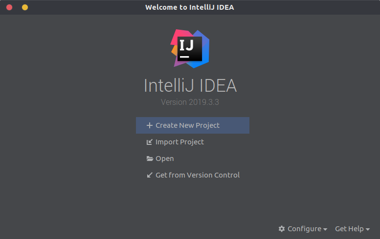

Selanjutnya di bagian kiri, pilih **Spring Initializr**.

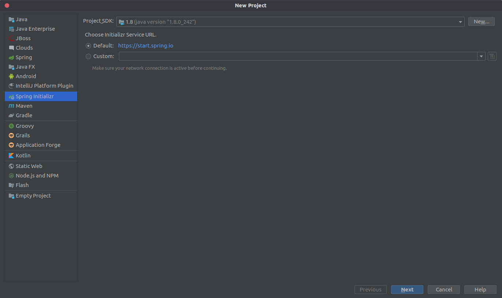

Isi _Group_, _Name_, dan _Description_ sesuka Anda dan yang terpenting pilih *Type* **Gradle Project**.

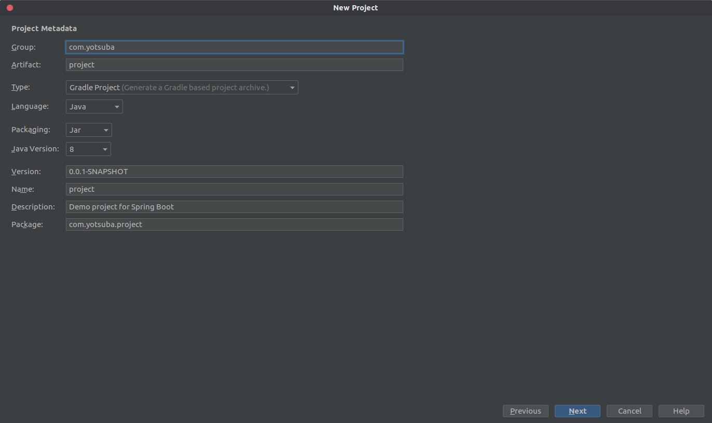

Pilih **Web** di bagian kiri, lalu centang **Spring Web**.

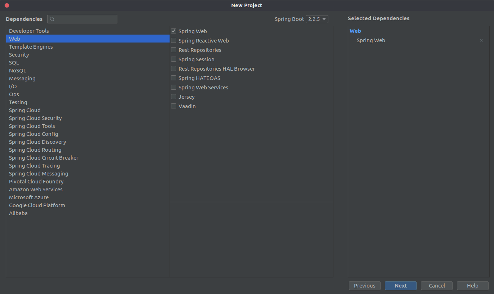

Buat nama proyek sesuka Anda dan folder di mana proyek tersebut akan disimpan.

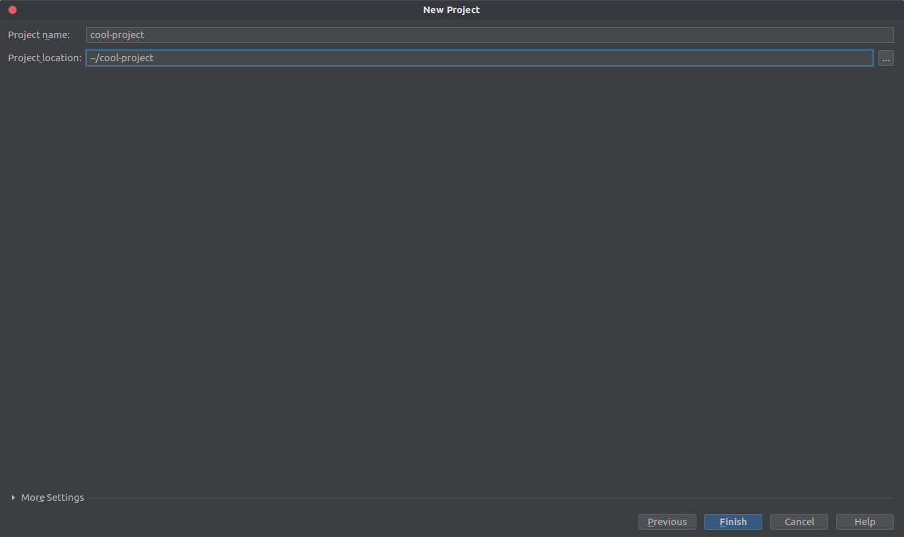

Anda akan melihat _file_ seperti berikut ini.

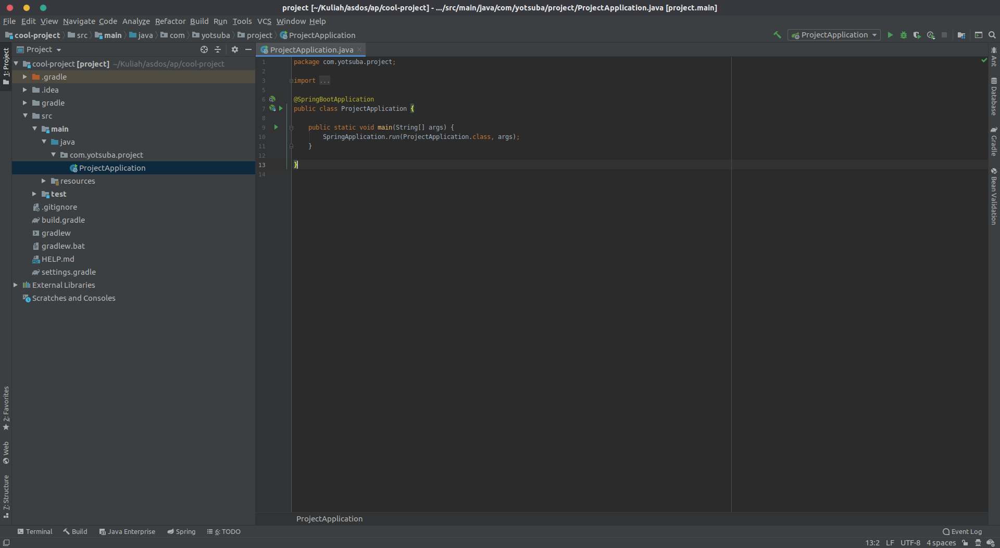

Coba jalankan aplikasi tersebut dan lalu buka `http://localhost:8080` dan Anda akan melihat halaman _error_ 404.

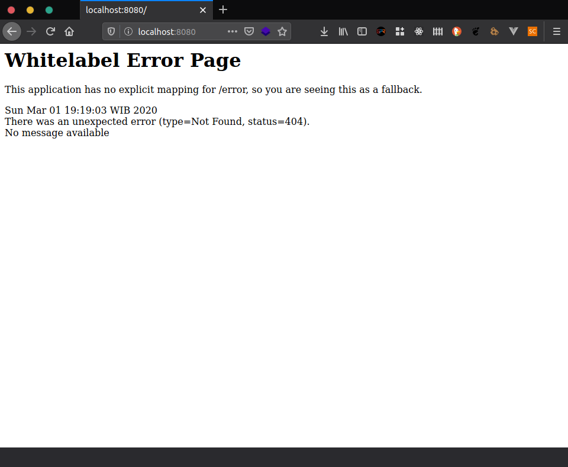

Selanjutnya Anda akan membuat halaman **Hello World** sederhana. Klik kanan pada _package_ aplikasi Anda
(Kalau Anda mengikuti persis tutorial ini, klik kanan di folder `com.yotsuba.project`), pilih **New**, lalu pilih
**Package**. Isi apapun terserah Anda, misalnya `controller`.

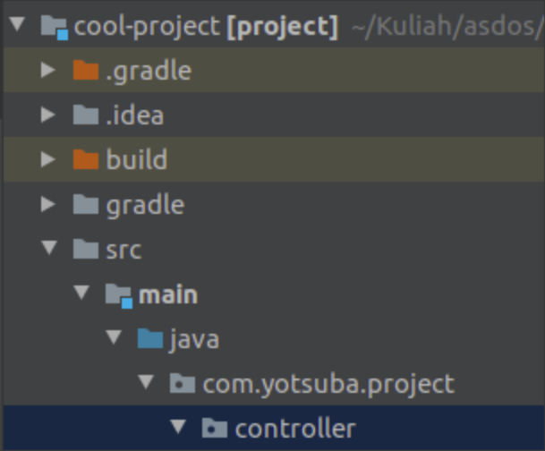

Selanjutnya klik kanan pada folder `controller`, pilih **New**, lalu pilih **Java Class**. Isi namanya terserah Anda,
misalnya `MainController`.

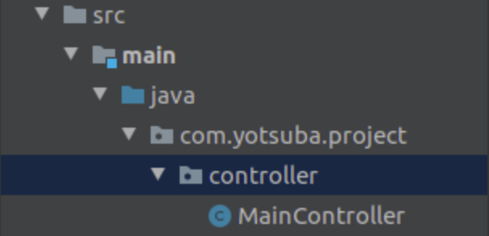

Lalu isi _file_ `MainController` dengan kode berikut. Jangan lupa ubah `com.yotsuba.project` dengan nama _package_
proyek yang Anda buat.

```java
package com.yotsuba.project.controller;

import org.springframework.stereotype.Controller;
import org.springframework.web.bind.annotation.RequestMapping;
import org.springframework.web.bind.annotation.RequestMethod;
import org.springframework.web.bind.annotation.ResponseBody;

@Controller
public class MainController {

    @RequestMapping(method = RequestMethod.GET, value = "/")
    @ResponseBody
    private String helloWorld() {
        return "Hello World";
    }
}
```

Jalankan kembali aplikasi tersebut.

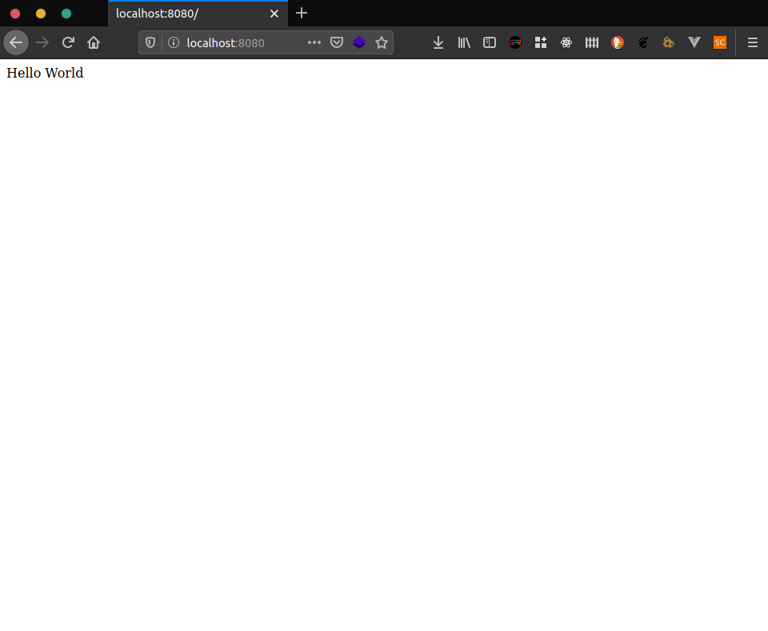

Tutorial di atas sangat berguna untuk memulai pembuatan proyek kelompok kalian.

Untuk tutorial kali ini, kalian akan membuat modul baru di repo ini.

Pertama buka repo tutorial AP Anda di IntelliJ Idea. Pada bagian kiri, klik kanan pada folder *root project* Anda,
pilih **New**, lalu pilih **Module**.

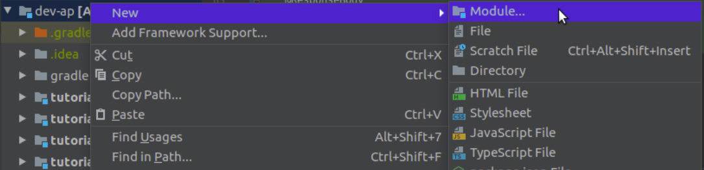

Pilih **Gradle** di bagian kiri lalu centang **Java**.

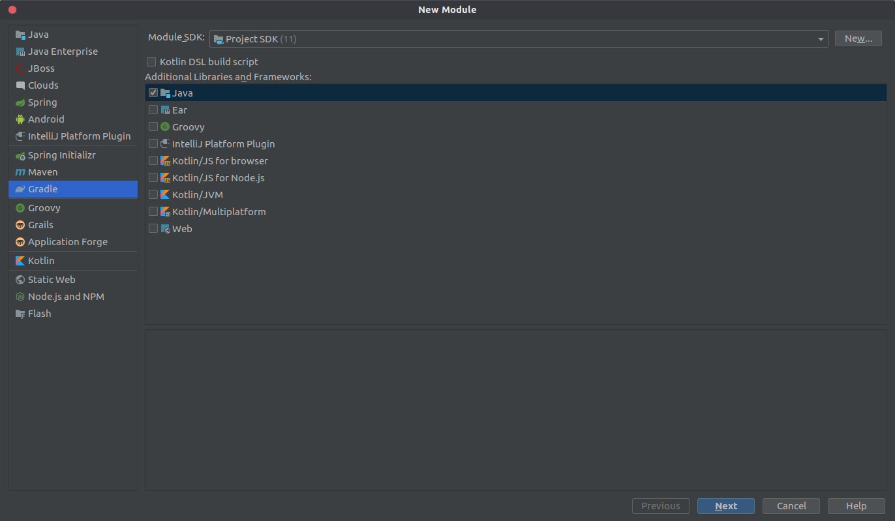

Isi nama modulnya dengan `tutorial-5`.

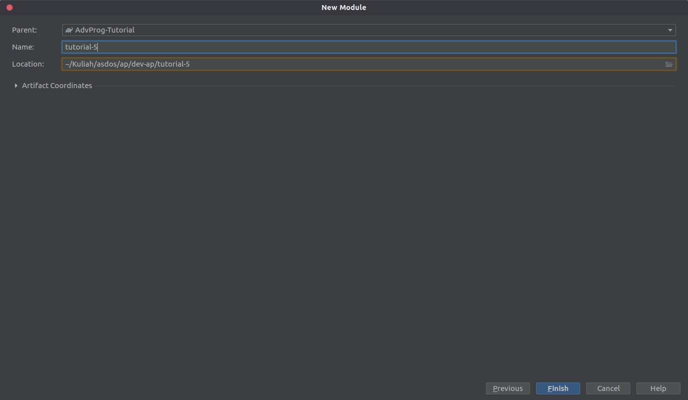

Lalu secara otomatis Anda IntelliJ akan menambahkan banyak folder di folder `tutorial-5`.

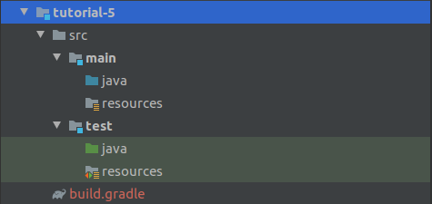

Selanjutnya klik kanan pada folder `java` yang berada di dalam folder `tutorial-5/main`, lalu pilih **New**,
kemudian pilih `Package`. Isi dengan `id.ac.ui.cs.advprog.tutorial5`. Setelah itu klik kanan pada folder
`id.ac.ui.cs.advprog.tutorial5`, pilih **New**, lalu pilih **Java Class**, isi dengan `Tutorial5Application`.

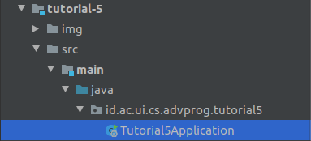

Isi file tersebut dengan kode berikut.

```java
package id.ac.ui.cs.advprog.tutorial5;

import org.springframework.boot.SpringApplication;
import org.springframework.boot.autoconfigure.SpringBootApplication;

@SpringBootApplication
public class Tutorial5Application {

    public static void main(String[] args) {
        SpringApplication.run(Tutorial5Application.class, args);
    }

}
```

Lalu kemudian agar aplikasi tersebut bisa berjalan, edit _file_ `build.gradle` di folder `tutorial-5`
dengan menyalin _file_ `build.gradle` di `tutorial-4`. Setelah itu `Tutorial5Application` sudah bisa
dijalankan.

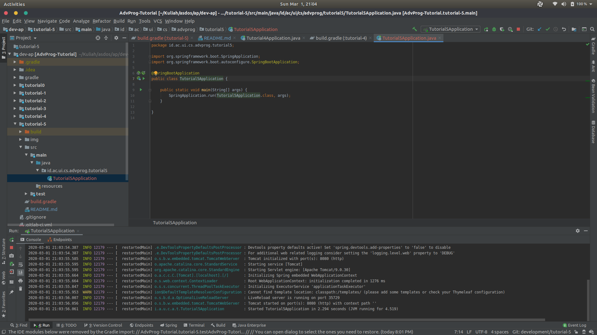

Selanjutnya silakan lanjutkan tutorial di bawah ini.

## (Dependencies and Gitlab CI)
------------------------
Karena anda membuat sistem sendiri, anda harus mengatur dependency apa saja yang anda perlukan pada `build.gradle`. Sebagai permulaan, berikut dependency yang dibutuhkan untuk JPA dan postgresql.
```gradle
dependencies {
implementation('org.springframework.boot:spring-boot-starter-data-jpa')
implementation('org.springframework.boot:spring-boot-starter-web')
implementation('org.postgresql:postgresql')
testImplementation('org.springframework.boot:spring-boot-starter-test')
}
````
Perlu diingat bahwa anda mungkin memerlukan dependency lain selain dependency di atas.

Kemudian, anda harus menambahkan pipeline script untuk tutorial-5. Sebenarnya tidak sulit, karena polanya sama seperti tutorial sebelumnya. Jangan lupa juga untuk menambahkan markdown pipeline dan coverage di bagian atas `README.md`.

## (Postgresql Configuration)
------------------------
Kemudian, anda mencoba menghubungkan sistem anda ke database agar data yang anda kelola pada sistem ini dapat terjaga. Anda akhirnya membuat konfigurasi seperti di bawah ini.
```properties
server.port=8080

spring.datasource.url = jdbc:postgresql://127.0.0.1:5432/test
spring.datasource.username = [your postgresql username]
spring.datasource.password = [your postgresql password]

# JPA/Hibernate properties
spring.jpa.show-sql = true

# Hibernate ddl auto (create, create-drop, update): with "update" the database
# schema will be automatically updated accordingly to java entities found in project
spring.jpa.hibernate.ddl-auto = update

spring.jpa.properties.hibernate.dialect = org.hibernate.dialect.PostgreSQLDialect
spring.jpa.hibernate.naming.strategy = org.hibernate.cfg.ImprovedNamingStrategy
````
Anda menyimpan konfigurasi ini dengan nama `application.properties` pada `src/main/resources`.

Note: Jika anda belum menginstall postgresql, dapat mengunduh installernya di [sini](https://www.postgresql.org/).

## (JPA Models and Repositories)
------------------------
Setelah melakukan konfigurasi, anda akhirnya dapat menggunakan JPA untuk mengelola jiwa yang ada di dunia ini. Namun, anda harus mendefinisikan apa saja informasi yang anda butuhkan dari setiap jiwa. Yang jelas, anda perlu tahu nama pemiliki jiwa tersebut. Kemudian, informasi umum seperti gender dan umur sepertinya juga anda butuhkan. Anda bingung informasi apalagi yang anda perlukan, hingga akhirnya anda teringat 'academy' yang anda bangun bersama []. Ya, anda membutuhkan okupasi atau profesi dari setiap jiwa. Anda memiliki ide untuk memperbaiki ini semua dengan JPA...

Oke, fokus! Yang pertama adalah membuat entitas jiwa tersebut. Anda menamakannya `Soul.java`

```java
import javax.persistence.Column;
import javax.persistence.Entity;
import javax.persistence.GeneratedValue;
import javax.persistence.GenerationType;
import javax.persistence.Id;
import javax.persistence.Table;

@Entity
@Table(name = "soul")
public class Soul {
	@Id
	@GeneratedValue(strategy = GenerationType.AUTO)
	private long id;
	 
	@Column(name = "name")
	private String name;
 
	// TODO: Lengkapi atribut yang sudah anda rencanakan. Ingat bahwa atribut yang dibuat bersifat privat.
}
````

Ya, seharusnya sudah cukup. Kemudian, sama seperti sebelumnya, anda memerlukan repositori untuk menyimpan informasi jiwa yang anda dapat. Kebetulan, JPA memiliki Repositori yang bisa anda gunakan dengan cara mengextendnya. Andapun membuat `SoulRepository.java`

```java
import org.springframework.data.jpa.repository.JpaRepository;
	
// TODO: Import Soul.java

public interface SoulRespository extends JpaRepository<Soul, Long> {
}
````

## (Data Seeding)
------------------------
Sebelum anda meninggalkan 'academy', anda berhasil mencuri informasi beberapa jiwa, salah satu diantaranya mengejutkan...
```sql
INSERT INTO soul (id, name, age, gender, occupation) VALUES (1, "Vincent", 17, "M", "Farmer");
INSERT INTO soul (id, name, age, gender, occupation) VALUES (2, "Shizuka", 19, "F", "Priestess");
INSERT INTO soul (id, name, age, gender, occupation) VALUES (3, "Grant", 16, "M", "Majestic Knight");
INSERT INTO soul (id, name, age, gender, occupation) VALUES (4, "Knight 101", 17, "F", "Synthetic Knight");
INSERT INTO soul (id, name, age, gender, occupation) VALUES (5, "Ex 73", 15, "M", "Mage");
INSERT INTO soul (id, name, age, gender, occupation) VALUES (6, "[]", 70, "?", "???");
INSERT INTO soul (id, name, age, gender, occupation) VALUES (7, "Jun", 20, "M", "Metal Cluster Knight");
INSERT INTO soul (id, name, age, gender, occupation) VALUES (8, "wslhzl", 17, "M", "Majestic Knight");
INSERT INTO soul (id, name, age, gender, occupation) VALUES (9, "olsw", 18, "F", "Synthetic Knight");
INSERT INTO soul (id, name, age, gender, occupation) VALUES (10, "bz", 19, "M", "Metal Cluster Knight");

````
Anda memutuskan untuk menyimpan informasi ini ke dalam `data.sql` dan menyimpannya pada `/src/main/resources` untuk dibaca JPA.

## (Service)
------------------------
Selanjutnya, anda membuat service yang dapat digunakan controller untuk mengakses informasi jiwa yang anda simpan. Anda namakan interfacenya `SoulService.java` dan implementasinya `SoulServiceImpl.java`.

```java
// TODO: Import Soul.java, Optional, dan List
	
public interface SoulService {
	public List<Soul> findAll();
	public Optional<Soul> findSoul(Long id);
	public void erase(Long id); //delete
	public Soul rewrite(Soul soul); //update
	public Soul register(Soul soul); //create
}

````

```java
// TODO: Import service bean
@Service
public class SoulServiceImpl implements SoulService {
	// TODO: implementasi semua method di SoulService.java. Coba lihat dokumentasi JpaRepository untuk mengimplementasikan Service
}
````

## (REST Controller)
------------------------
Setelah JPA dan service selesai diimplementasi, yang terakhir adalah menyediakan REST Controller. Controller ini anda gunakan untuk melakukan transaksi data. Berikut rancangan `SoulController.java` anda.

```java
// TODO: Import apapun yang anda perlukan agar controller ini berjalan
@RestController
@RequestMapping(path = "/soul")
public class SoulController {

	@Autowired
	private final SoulService soulService;

    @GetMapping
    public ResponseEntity<List<Soul>> findAll() {
        // TODO: Use service to complete me.
    }

    @PostMapping
    public ResponseEntity create(@RequestBody Soul soul) {
        // TODO: Use service to complete me.
    }

    @GetMapping("/{id}")
    public ResponseEntity<Soul> findById(@PathVariable Long id) {
        // TODO: Use service to complete me.
    }
	
	@PutMapping("/{id}")
    public ResponseEntity<Soul> update(@PathVariable Long id, @RequestBody Soul soul) {
        // TODO: Use service to complete me.
    }

    @DeleteMapping("/{id}")
    public ResponseEntity delete(@PathVariable Long id) {
        // TODO: Use service to complete me.
    }
}
````

## (System Milestones)
------------------------
- [ ] Membuat spring project sendiri.
- [ ] Mendefinisikan dependency yang diperlukan pada `build.gradle`.
- [ ] Menambahkan pipeline untuk tutorial-5.
- [ ] Menambahkan markdown pipeline dan coverage pada `README.md`.
- [ ] Melakukan konfigurasi postgresql dengan JPA.
- [ ] Mendefinisikan dependency yang diperlukan. 
- [ ] Membuat struktur penyimpanan source code. Sebagai refrensi, bisa melihat pekerjaan anda sebelumnya.
- [ ] Membuat models dan repositori JPA.
- [ ] Membuat service.
- [ ] Membuat REST Controller.

## (Testing)
------------------------
Anda sadar bahwa sistem yang anda gunakan SANGAT BERBAHAYA! Anda harus membuat test case agar memastikan tidak ada kesalahan pengolahan jiwa yang berakibat fatal.

## (Try Your System)
------------------------
Setelah anda membuat test case. Anda membuat TO-DO List untuk mencoba sistem anda secara langsung.
- [ ] Daftarkan setidaknya 5 jiwa baru.
- [ ] Coba akses informasi dari semua jiwa yang ada di sistem anda.
- [ ] Coba akses informasi dari sebuah jiwa yang ada di sistem anda.
- [ ] Coba ubah informasi salah satu jiwa yang ada di sistem anda.
- [ ] Coba hapus salah satu jiwa yang ada di sistem anda. Kemudian daftarkan kembali jiwa tersebut dengan informasi yang sama persis.

## ([])
------------------------
- [ ] Beberapa jiwa telah menjadi 'Knight' karena 'academy' yang anda buat bersama []. Ubah profesi semua jiwa yang memiliki okupasi dengan jenis Knight hasil 'academy'. Ubah menjadi profesi apapun yang menurut anda wajar.
- [ ] Ada beberapa jiwa yang namanya telah berubah karena []. Ubah nama mereka menjadi nama yang wajar menurut anda.
- [ ] Terakhir... anda tahu harus apa... HAPUSKAN [] DARI DUNIA INI!

## (Additional Note)
------------------------
Karena anda merancang sendiri sistem ini dari nol, mungkin anda ingin mengeksplor hal lain yang ada dalam Spring Boot. Mungkin anda menemukan library lain yang dapat memudahkan anda dalam membuat sistem ini. Atau mungkin anda memiliki cara lain untuk mengimplementasi suatu hal, misalnya data seeding. Jangan terlalu terpaku dengan `template`. Jika merasa itu hal baik untuk diimplementasikan, tidak ada salahnya. Bisa saja hasil eksplorasi anda berguna di kemudian hari.